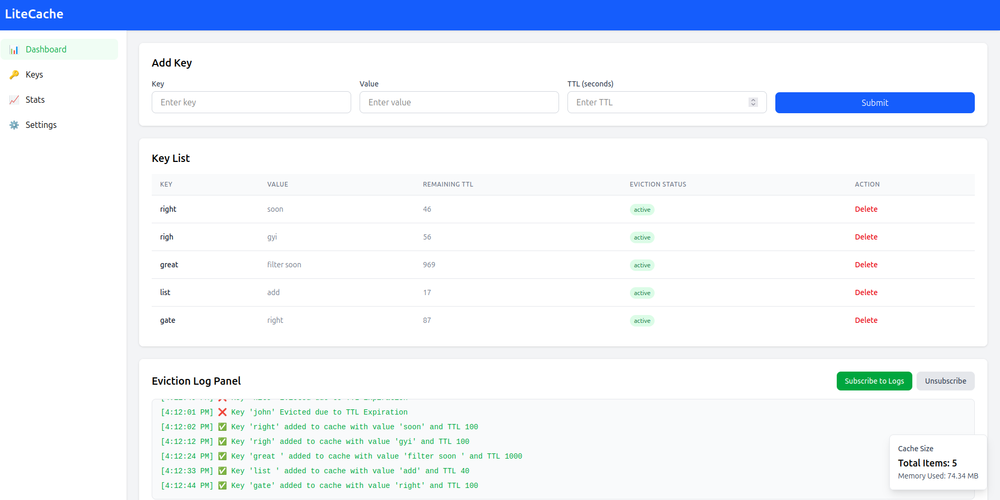

# ⚡ LiteCache - A Fast In-Memory Cache with TTL, LRU & Live Dashboard

LiteCache is a blazing-fast in-memory cache system written in **Node.js**, featuring:

- ✅ Time-To-Live (TTL) based expiration
- ✅ Least Recently Used (LRU) eviction
- ✅ Live WebSocket-based eviction logs
- ✅ REST API for managing cache keys
- ✅ Real-time frontend dashboard built in **React**

---

## 📸 Demo Screenshot




---

## 🚀 Features

| Feature               | Description                                     |
| --------------------- | ----------------------------------------------- |
| ⏳ TTL Expiry         | Automatically removes expired keys in batches   |
| 🔁 LRU Eviction       | Evicts least recently used key on size overflow |
| 🌐 REST API           | Full CRUD API for key management                |
| 📡 WebSocket Logs     | Realtime eviction updates to frontend           |
| 📊 Memory Stats       | Displays current memory usage & item count      |
| 🔧 Configurable Limit | Change cache size limit on-the-fly              |

---

## 🛠 Tech Stack

**Frontend:** React, Tailwind CSS, Socket.io-client  
**Backend:** Node.js, Express, Socket.io  
**Cache Core:** Custom implementation using `Heap`, `Doubly Linked List`, and `Map`

---

## 📦 Installation

```bash
git clone https://github.com/your-username/LiteCache.git
cd LiteCache

# Install backend dependencies
cd server
npm install

# Install frontend dependencies
cd ../client
npm install
```

---

## 🔧 Usage

### 1. Start the Backend

```bash
cd server
npm run dev
```

### 2. Start the Frontend

```bash
cd client
npm run dev
```

Frontend runs at `http://localhost:5173`  
Backend runs at `http://localhost:3000`

---

## 📡 API Endpoints

| Method | Endpoint             | Description            |
| ------ | -------------------- | ---------------------- |
| GET    | `/cache`             | Get all keys           |
| GET    | `/cache/get/:key`    | Get a specific key     |
| POST   | `/cache/set`         | Add or update a key    |
| DELETE | `/cache/delete/:key` | Delete a key           |
| GET    | `/cache/stats`       | Get memory + size info |

---

## 🔍 Sample Payload

### Add Key

```json
POST /cache/set
{
  "key": "username",
  "value": "vishesh",
  "ttl": 5000
}
```

---

## 🧠 Architecture

```txt
                +------------------------+
                |      React Frontend    |
                |  - Displays Cache Keys |
                |  - TTL Countdown       |
                |  - Live Logs           |
                +-----------+------------+
                            |
                   REST & WebSocket
                            |
                +-----------v------------+
                |      Node.js Server    |
                | - Express REST API     |
                | - Socket.IO Events     |
                +-----------+------------+
                            |
                        LiteCache
                            |
        +-------- Map --------- Heap ---------- List --------+
        |      (O(1) lookup)   (TTL expiry)   (LRU tracking) |
        +----------------------------------------------------+
```

---

## 📈 Memory Usage

Memory usage is calculated using Node’s `process.memoryUsage()`:

```json
{
  "heapUsed": "4.12 MB",
  "rss": "12.45 MB",
  "totalItems": 43
}
```

---

## 👥 Contributors

- guru420e(https://github.com/guru420e) – Full Stack Dev

---

## 📄 License

MIT License. Feel free to use and contribute!
